# Documentación de pruebas funcionales — CloudTasks

**Equipo:** cloudtask-equipo1-4
**Integrantes:** Verónica Flor Escobar, Isabella Vergara Valencia, Valentina Tangarife Rincón, Dayanna Fernández
**Fecha de ejecución:** 15/09/2026
**URL de la aplicación:** https://cloudtask-equipo1-4-ieudbxbmq-iisaaaa.vercel.app/index.html (provicional mientras nos dan el dominio)
**Repositorio:** las-chicas-ingesoft/ cloudtask-equipo-1-4

---

## 1. Entorno de pruebas

| Elemento | Detalle |
|---|---|
| Navegador y versión | Chrome 152 |
| Sistema operativo | Windows |
| Frontend desplegado en | Vercel |
| Backend / base de datos | Supabase (PostgreSQL administrado) |
| DNS y TLS | Cloudflare |
| Usuario de prueba | isabellavergaravalencia@gmail.com |

---

## 2. Pruebas de integración definidas por el docente

Estas son las pruebas de la hoja "Pruebas integración" de la rúbrica. Llenar las columnas **Resultado obtenido**, **Cumple** y **Evidencia**.

### 2.1 Cloudflare

| ID | Prueba | Procedimiento | Resultado esperado | Resultado obtenido | Cumple | Evidencia |
|---|---|---|---|---|---|---|
| CF-01 | Acceso por dominio | Abrir el dominio/subdominio en el navegador. | La aplicación carga correctamente. | La aplicación cargó exitosamente | Sí / No / **Bloqueado** | 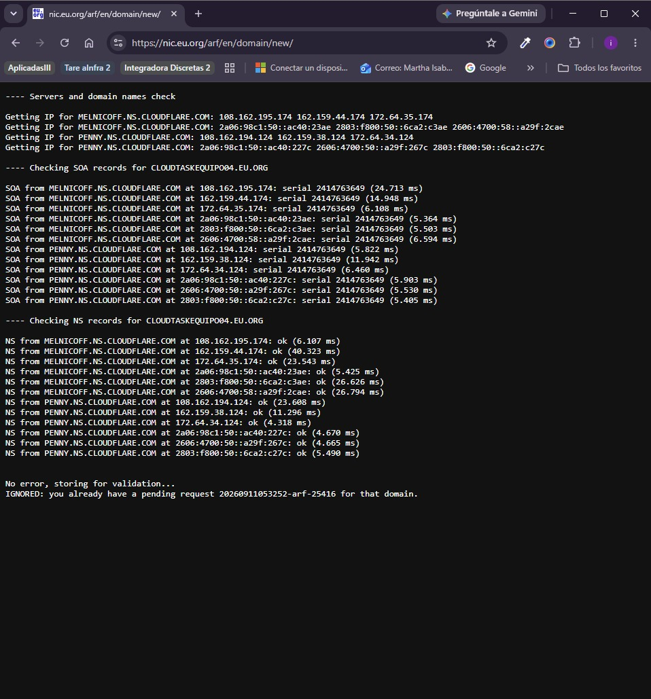 |
| CF-02 | DNS | Revisar el panel de DNS en Cloudflare e identificar el registro creado. | El dominio resuelve al destino configurado (Vercel). | No tenemos dominio todavía | Sí / No / **Bloqueado** | 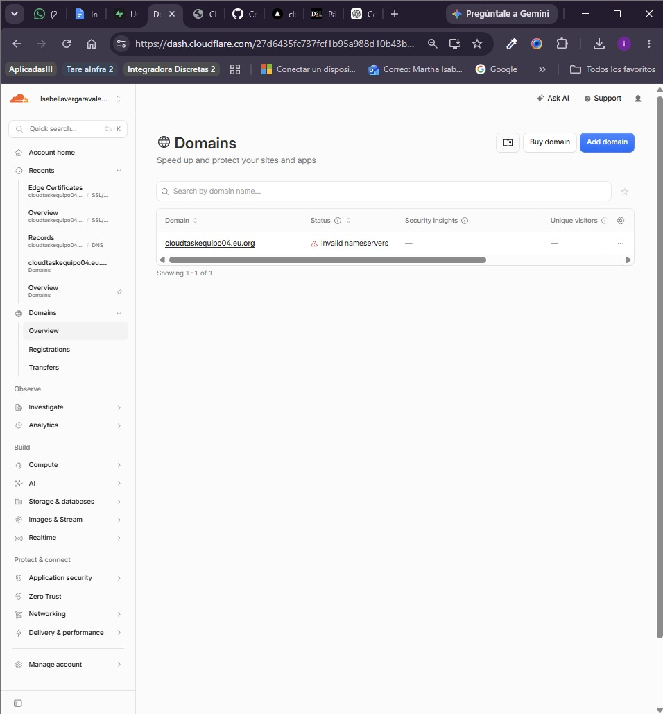 |
| CF-03 | HTTPS/TLS | Abrir la URL con `https://` y revisar el candado del navegador.jpg | HTTPS funcional, certificado válido. | No tenemos dominio todavía | Sí / No / **Bloqueado** | 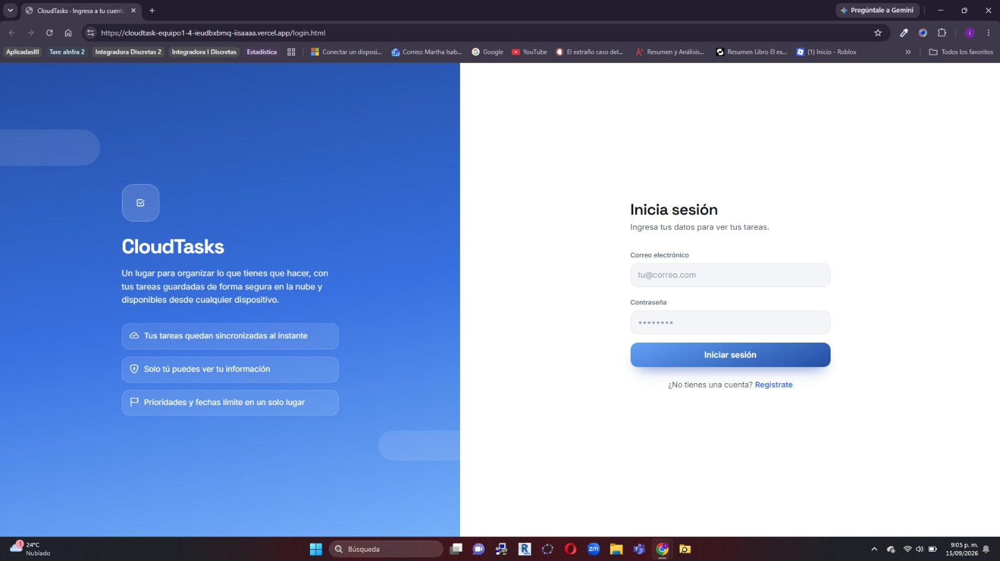 |
| CF-04 | Cloudflare → Vercel | Revisar el dominio registrado en ambos paneles. | La petición llega al deployment correcto. | No tenemos odminio todavía | Sí / No / **Bloqueado** |  |

> **Nota del equipo:** el dominio fue solicitado el 10/09/2026 y a la fecha de entrega no ha sido asignado, por lo que las pruebas CF-01 a CF-04 no pudieron ejecutarse por una dependencia externa al equipo. Se adjunta la evidencia de la solicitud. La configuración quedó preparada para aplicarse apenas se reciba el dominio.

### 2.2 Vercel

| ID | Prueba | Procedimiento | Resultado esperado | Resultado obtenido | Cumple | Evidencia |
|---|---|---|---|---|---|---|
| VE-01 | Deployment | Revisar el proyecto y el último deployment en Vercel. | Deployment en estado "Ready" / exitoso. | Deploy en estado "Ready" |  **Sí** / No / Bloqueado |  |
| VE-02 | GitHub → Vercel | Hacer un cambio pequeño, `git push` a `main` y revisar Vercel. | Se genera automáticamente un nuevo deployment. | Se genera el cambio | **Sí** / No / Bloqueado | 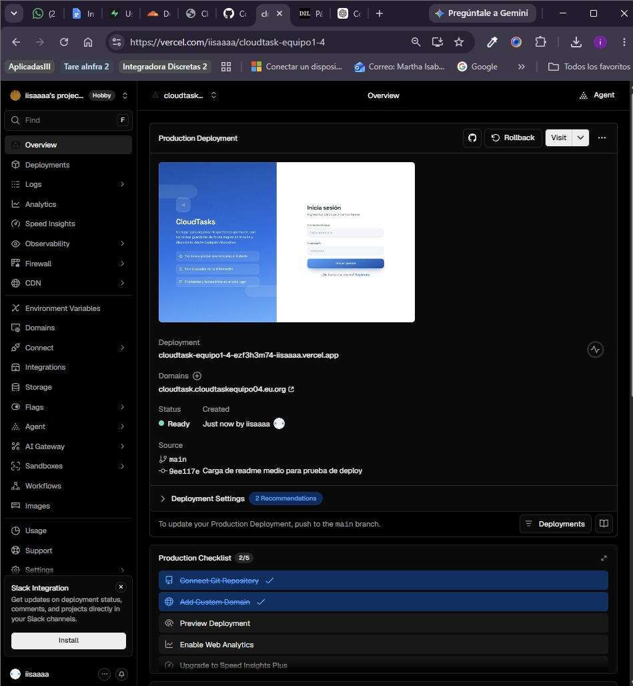 |

### 2.3 Supabase

| ID | Prueba | Procedimiento | Resultado esperado | Resultado obtenido | Cumple | Evidencia |
|---|---|---|---|---|---|---|
| SU-01 | Crear y verificar en BD | Crear una tarea desde la app y buscarla en Table Editor → `tasks`. | El registro aparece en PostgreSQL con su `user_id`. |  El registro aparece| **Sí** / No / Bloqueado | 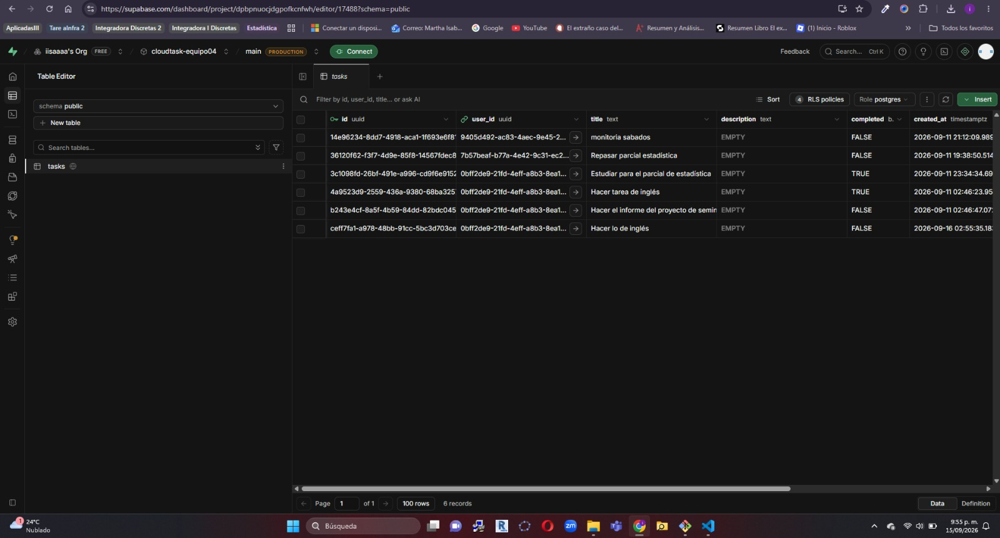 |
| SU-02 | Actualizar | Marcar la tarea como completada, recargar la página y revisar la BD. | El campo `completed` queda en `true` y coincide app ↔ BD. | El campo quedó en "true" | **Sí** / No / Bloqueado | 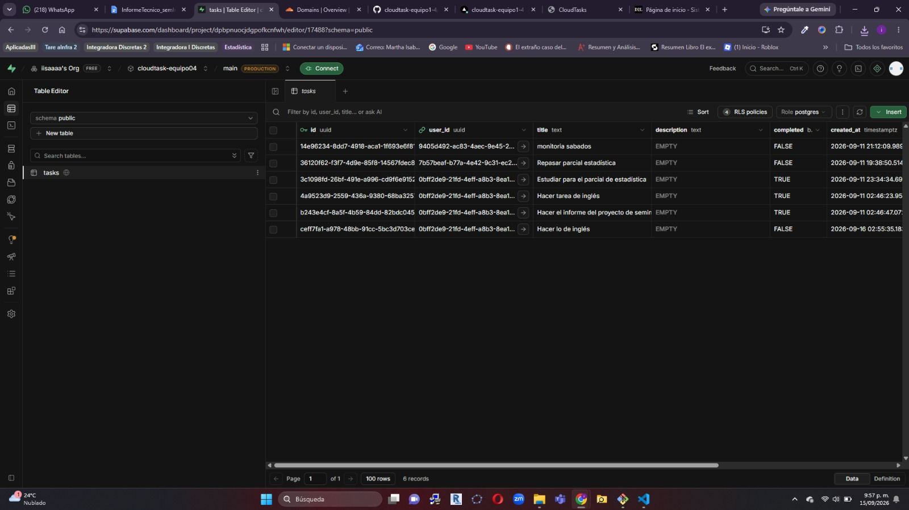 |
| SU-03 | Eliminar | Eliminar la tarea desde la app y revisar la tabla. | El registro desaparece de `tasks`. | El registro desapareció de task | **Sí** / No / Bloqueado | 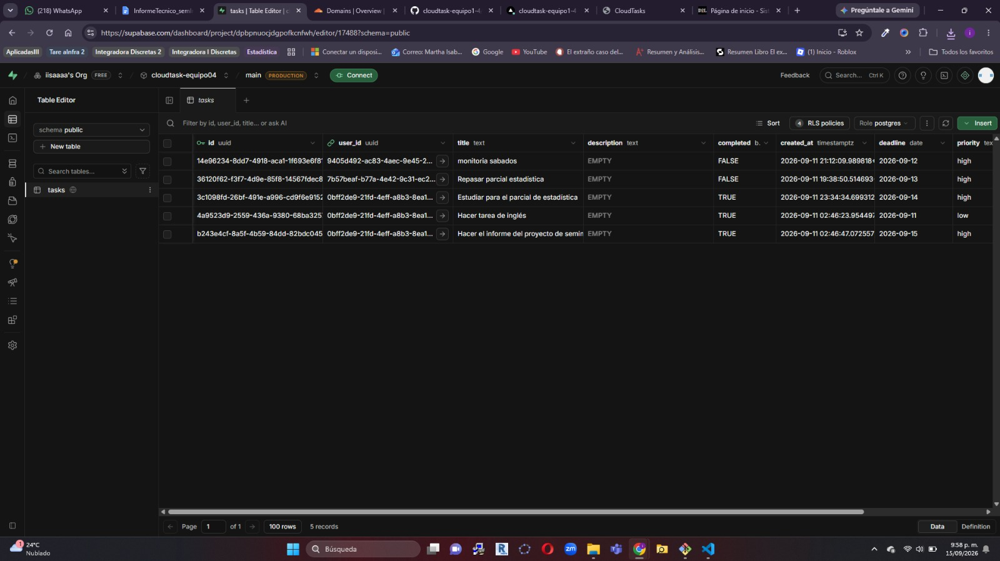 |
| SU-04 | Persistencia | Crear/modificar tareas, cerrar el navegador por completo y volver a entrar. | Los datos permanecen tal como se dejaron. | Los datos quedan igual como se dejaron | **Sí** / No / Bloqueado | 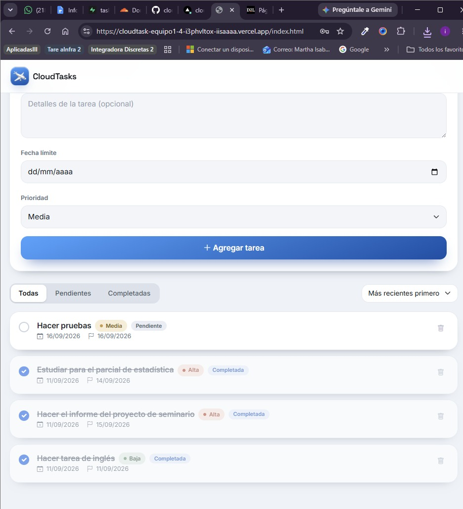 |

## 3. Pruebas de validación y manejo de errores

La rúbrica exige cubrir **casos normales y de error**. Estas pruebas demuestran que la aplicación valida entradas y responde bien ante fallos.

| ID | Prueba | Procedimiento | Resultado esperado | Resultado obtenido | Cumple | Evidencia |
|---|---|---|---|---|---|---|
| ER-01 | Título vacío | Enviar el formulario de nueva tarea dejando el título en blanco (o solo espacios). | La tarea no se crea; el campo se marca como inválido. | La tarea no se creó | **Sí** / No / Bloqueado| 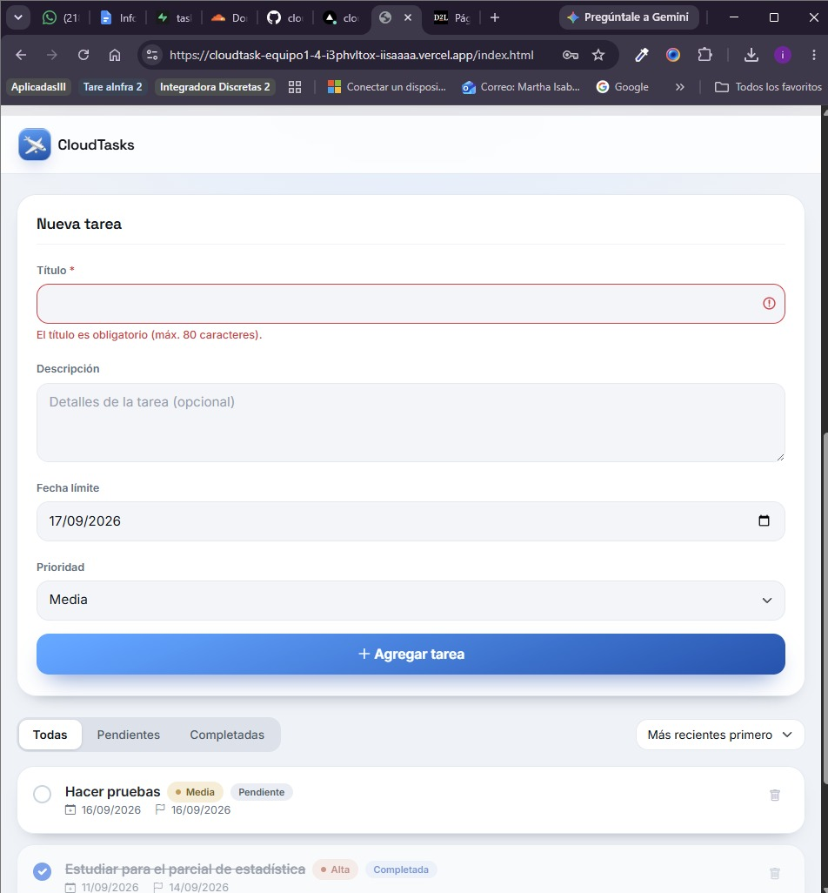 |
| ER-02 | Fecha límite en el pasado | Crear una tarea con fecha límite anterior a hoy. | La tarea no se crea; el campo de fecha se marca como inválido. | La tare no se creó | **Sí** / No / Bloqueado| 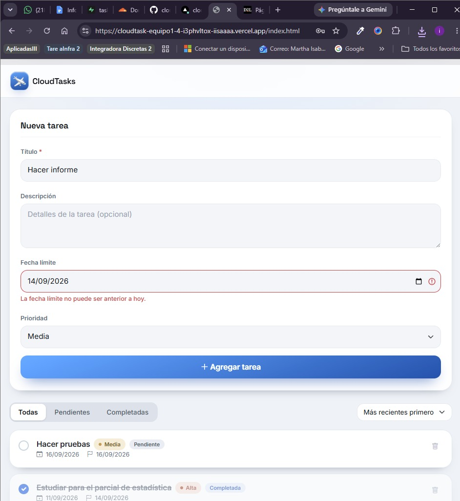|
| ER-03 | Credenciales incorrectas | Intentar iniciar sesión con una contraseña errónea. | Se muestra un mensaje de error traducido y no se inicia sesión. | No inicia sesión | **Sí** / No / Bloqueado | 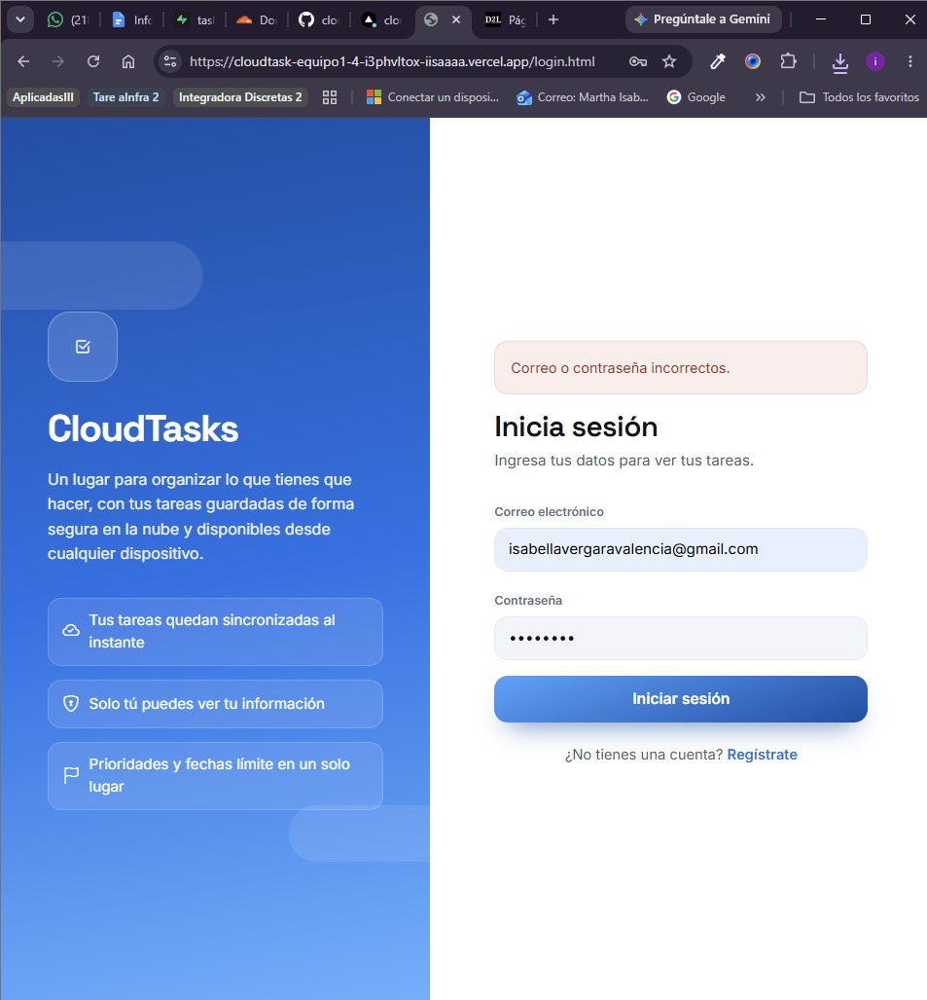 |
| ER-04 | Registro con correo duplicado | Registrarse con un correo que ya existe. | Se muestra un mensaje de error claro y no se crea el usuario. | No se crea el usuario y se muestra el mensaje de error | **Sí** / No / Bloqueado | 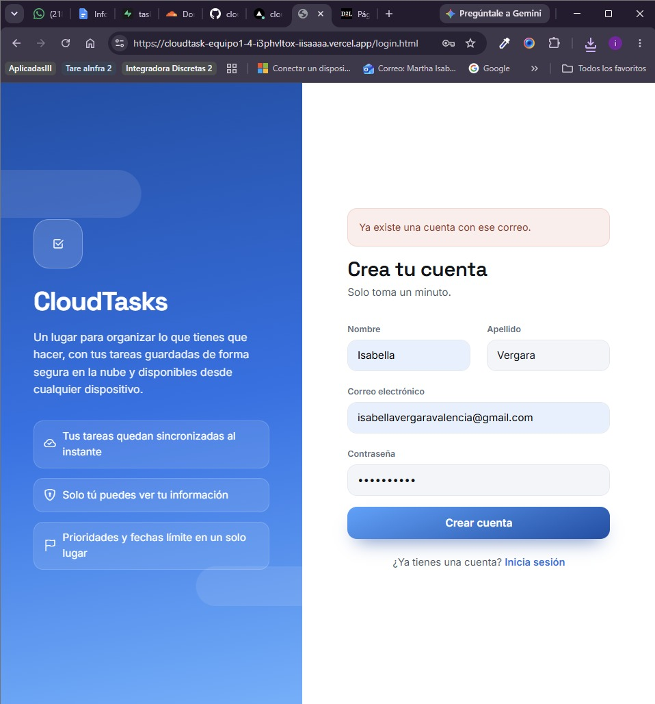 |
| ER-05 | Aislamiento entre usuarios (RLS) | Iniciar sesión con el usuario A, crear tareas; cerrar sesión, entrar con el usuario B. | El usuario B no ve ninguna tarea del usuario A. | El usuario B no ve ninguna tarea del usuario A | **Sí** / No / Bloqueado | 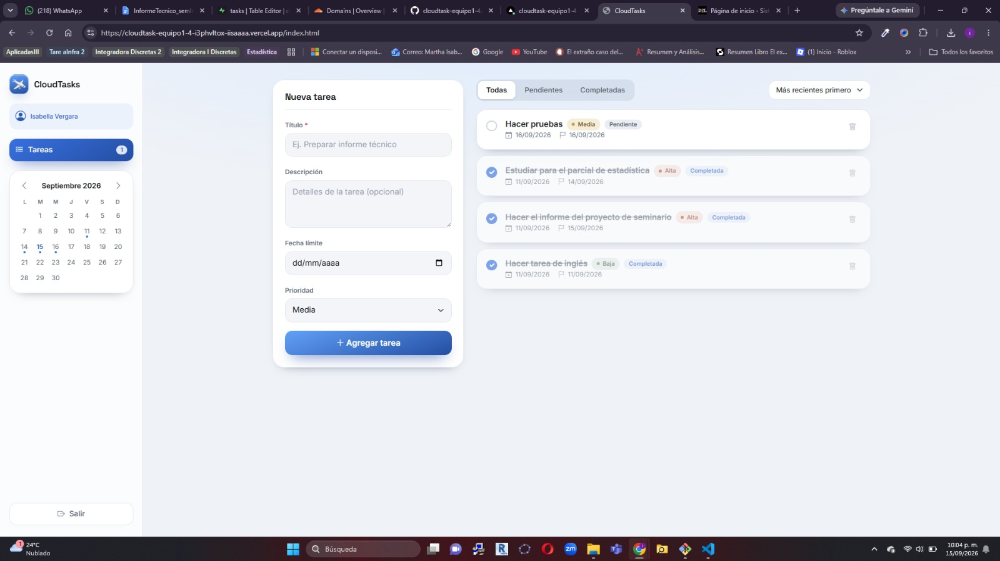 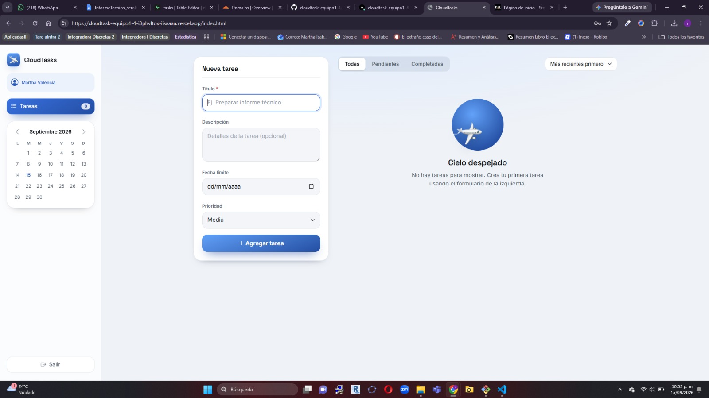|
| ER-06 | Acceso sin sesión | Abrir `index.html` directamente sin haber iniciado sesión. | Se redirige a la pantalla de login; no se muestran tareas. | Se redirige a la pantalla del login | **Sí** / No / Bloqueado | 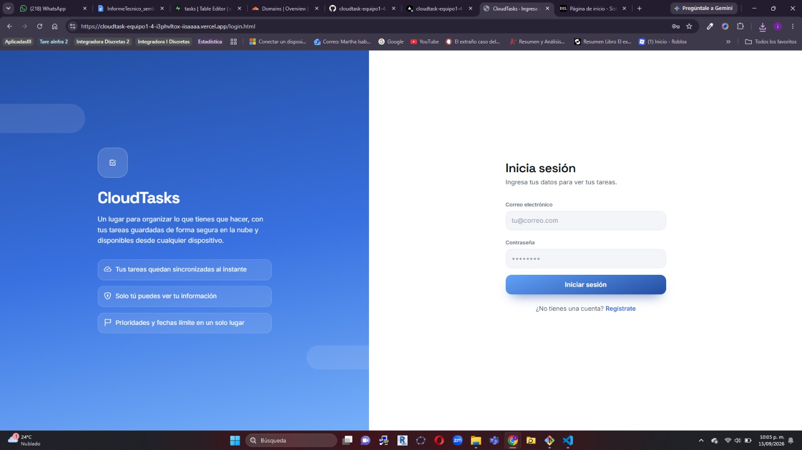 |
| ER-07 | Pérdida de conexión | Activar el modo offline del navegador (DevTools → Network → Offline) e intentar crear una tarea. | La app muestra un mensaje de error y no se cuelga. | No se crea la tarea y aparece mensaje de error | **Sí** / No / Bloqueado | 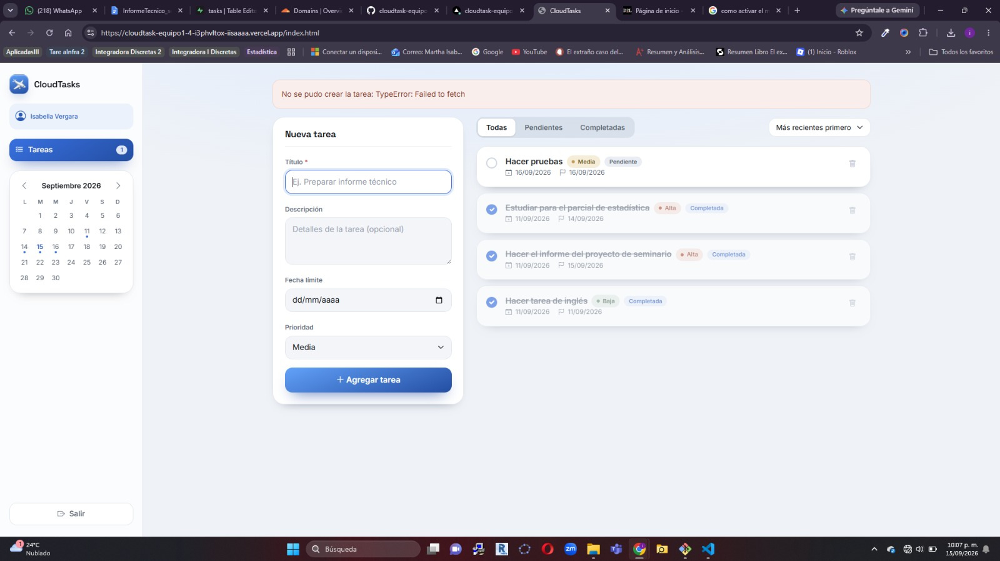 |

---

## 4. Resumen de resultados

| Categoría | Ejecutadas | Cumplen | No cumplen | Bloqueadas |
|---|---|---|---|---|
| Cloudflare (CF) | 4 | 0 | 0 | 4 |
| Vercel (VE) | 2 | 2  | 0  | 0 |
| Supabase (SU) | 4 | 4 | 0 | 0 |
| Errores y validaciones (ER) | 7 | 7 | 0 | 0 |
| **Total** | 17 | 13 | 0 | 4 |

---

## 5. Defectos encontrados y correcciones

La rúbrica valora explícitamente identificar defectos y **documentar cómo se corrigieron**. Registrar aquí cualquier fallo detectado durante las pruebas, aunque ya esté resuelto.

| N° | Prueba donde se detectó | Descripción del defecto | Causa | Corrección aplicada | Commit |
|---|---|---|---|---|---|
| 1 | ER-02 | Permitía ingresar fechaas anteriores al día actual al crear la tarea. | Falta de restricción en el input de fecha en el HTML inicial. | Se agregó una validación del cliente. | deaf2f455e396f7392751631268c05c9df7f9129 |
| 2 | ER-07 | Al perder la conexión de internet, la plicación se quedaba en un loop infinito al intentar cargar la tarea. | No se tenía configurado un tiempo límite de respuesta para las peticiones en modo offline. | Se implementó un bloque de try/catch para el manejo de excepciones en la red y una alerta para el usuario. | 87872366cd357f456a96dd0904f05078a02fa3c3 |
